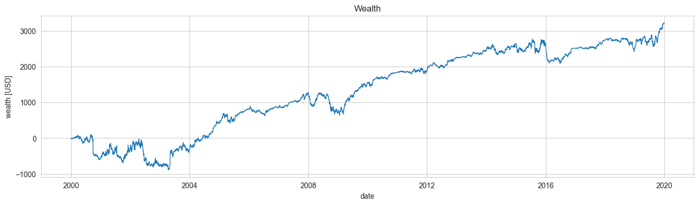
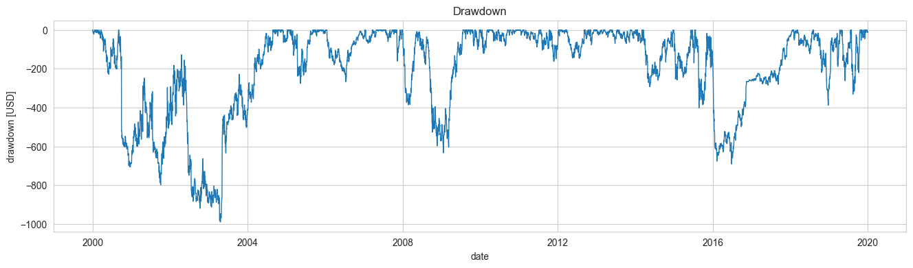
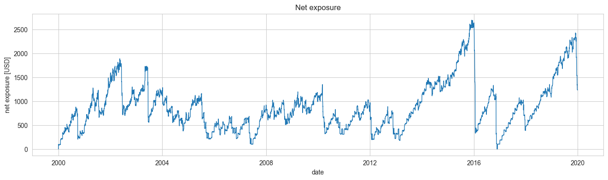

<p align="center">
    
</p>

<h1 align="center">Epymetheus: Multi-asset Backtesting Framework</h1>

[](https://pypi.org/project/epymetheus)
[](https://pypi.org/project/epymetheus)
[](https://github.com/epymetheus/epymetheus/actions/workflows/ci.yml)
[](https://codecov.io/gh/epymetheus/epymetheus)
[](https://pypi.org/project/epymetheus)
[](https://github.com/psf/black)



## Introduction

***Epymetheus*** is a multi-asset backtesting framework.

It features an intuitive user API that lets analysts try out their trade strategies right away.

### Features

1. **Intuitive and Pythonic API**
    - *Epymetheus* designs Pythonic API that lets you code your idea intuitively without any fuss.
    - Trading strategies can be readily coded as ordinary functions and then you can `run()` and `score()` it right away.
2. **Blazingly Fast Computation**
    - Backtesting is boosted by NumPy and so you can give your own idea a quick try.
    - Executions of profit-taking and stop-loss orders are built-in.
3. **Seamless Connection with [Pandas](https://github.com/pandas-dev/pandas)**
    - You can use `pandas.DataFrame` of historical prices as the target of backtesting.
    - You can view the result of backtesting in Pandas format so that you can analyze and plot it using the familiar Pandas methods.
4. **Full Test Coverage**:
    - Epymetheus is thoroughly tested by [continuous integration](https://github.com/epymetheus/epymetheus/actions?query=workflow%3ACI) with 100% code coverage.

### Integrations

Your trading strategy may incorporate various libraries out there, for instance,

* **Machine Learning** - [scikit-learn](https://github.com/scikit-learn/scikit-learn), [PyTorch](https://github.com/pytorch/pytorch), [TensorFlow](https://github.com/tensorflow/tensorflow), etc.
* **Econometrics** - [statsmodels](https://github.com/statsmodels/statsmodels), [Prophet](https://github.com/facebook/prophet), etc.
* **Technical Indicators** - [TA-Lib](https://github.com/mrjbq7/ta-lib), etc.
* **Hyperparameter Optimization** - [Optuna](https://github.com/optuna/optuna) (Example follows), etc.

## Installation

```sh
$ pip install epymetheus
```

## How to use

[](https://colab.research.google.com/github/epymetheus/epymetheus/blob/master/examples/readme/readme.ipynb)

### Create strategy

Let's construct your trading strategy.
The following "[dumb strategy](https://www.ted.com/talks/ray_dalio_how_to_build_a_company_where_the_best_ideas_win?language=en)" will,

* target a set of stocks whose `DataFrame` of historical prices is given by `universe`.
* buy the cheapest stock with your monthly allowance $100, and
* place a profit-taking order when your profit exceeds $`profit_take` and place a stop-loss order when your loss exceeds $`stop_loss`.

Here in the function `dumb_strategy`, the first argument `universe` is mandatory while the other arguments are parameters that you can define freely.

```python
import pandas as pd
import epymetheus as ep


def dumb_strategy(universe: pd.DataFrame, profit_take, stop_loss):
    # I get $100 allowance on the first business day of each month
    allowance = 100

    for date in pd.date_range(universe.index[0], universe.index[-1], freq="BMS"):
        cheapest_stock = universe.loc[date].idxmin()

        # Find the maximum number of shares that I can buy with my allowance
        n_shares = allowance // universe.at[date, cheapest_stock]

        trade = n_shares * ep.trade(cheapest_stock, date, take=profit_take, stop=stop_loss)
        yield trade
```

You can now create your strategy with specific parameters as:

```python
my_strategy = ep.create_strategy(dumb_strategy, profit_take=20.0, stop_loss=-10.0)
```

### Run strategy

Now you can backtest your strategy with any universe, for instance, US stocks.

```python
from epymetheus.datasets import fetch_usstocks

universe = fetch_usstocks()
universe.head()
#                 AAPL       MSFT     AMZN  BRK-A        JPM        JNJ        WMT        BAC         PG        XOM
# 2000-01-01  0.785456  37.162327  76.1250  56100  27.773939  27.289129  46.962898  14.527933  31.304089  21.492596
# 2000-01-02  0.785456  37.162327  76.1250  56100  27.773939  27.289129  46.962898  14.527933  31.304089  21.492596
# 2000-01-03  0.855168  37.102634  89.3750  54800  26.053429  26.978193  45.391777  14.021359  30.625511  20.892334
# 2000-01-04  0.783068  35.849308  81.9375  52000  25.481777  25.990519  43.693306  13.189125  30.036228  20.492161
# 2000-01-05  0.794528  36.227283  69.7500  53200  25.324482  26.264877  42.801613  13.333860  29.464787  21.609318
```

```python
my_strategy.run(universe)
# 240 trades returned: trade(['BAC'], lot=[3.], entry=2019-12-02 00:00:00, take=20.0, stop=-10.0) ... Done. (Runtume: 0.1034 sec)
# 240 trades executed: trade(['BAC'], lot=[3.], entry=2019-12-02 00:00:00, take=20.0, stop=-10.0) ... Done. (Runtime: 0.2304 sec)
# Done. (Runtime: 0.3338 sec)
```

### Trade history and wealth

Trade history can be viewed as:

```python
df_history = my_strategy.history()
df_history.head()
#    trade_id asset    lot      entry      close  exit  take  stop        pnl
# 0         0  AAPL  115.0 2000-01-03 2005-01-07  None  20.0 -10.0  23.527901
# 1         1  AAPL  129.0 2000-02-01 2000-09-29  None  20.0 -10.0 -48.437450
# 2         2  AAPL   99.0 2000-03-01 2005-07-14  None  20.0 -10.0  24.924913
# 3         3  AAPL   97.0 2000-04-03 2005-07-14  None  20.0 -10.0  22.180065
# 4         4  AAPL  104.0 2000-05-01 2005-05-19  None  20.0 -10.0  20.736752
```

The time-series of wealth can be viewed as:

```python
series_wealth = my_strategy.wealth()
series_wealth.head()
# 2000-01-01    0.000000
# 2000-01-02    0.000000
# 2000-01-03    0.000000
# 2000-01-04   -8.363557
# 2000-01-05   -7.034265
# Freq: D, dtype: float64
```


### Scores

You can quickly `score()` the metrics of the strategy.

```python
my_strategy.score("final_wealth")
# 3216.74
my_strategy.score("max_drawdown")
# -989.19
```

You may compute various time-series.

```python
drawdown = my_strategy.drawdown()
exposure = my_strategy.net_exposure()
```




## More examples

### Optimization

You may optimize the parameters of your strategy using [Optuna](https://github.com/optuna/optuna) for example.

Remember that optimization for backtesting is dangerous.

```python
import optuna


def objective(trial):
    profit_take = trial.suggest_int("profit_take", 10, 100)
    stop_loss = trial.suggest_int("stop_loss", -100, -10)

    my_strategy = ep.create_strategy(
        dumb_strategy,
        profit_take=profit_take,
        stop_loss=stop_loss,
    ).run(universe, verbose=False)

    return my_strategy.score("final_wealth")


study = optuna.create_study(direction="maximize")
study.optimize(objective, n_trials=100)

study.best_params
# {'profit_take': 100, 'stop_loss': -42}
```

### Pair trading

Trade can include multiple stocks.

Profit-take and stop-loss will be executed when the total profit/loss exceed thresholds.

```python
def pair_trading_strategy(universe, param_1, ...):
    ...
    # Buy 1 share of "BULLISH_STOCK" and sell 2 shares of "BEARISH_STOCK".
    yield [1, -2] * ep.trade(["BULLISH_STOCK", "BEARISH_STOCK"], stop=-100.0)
```
